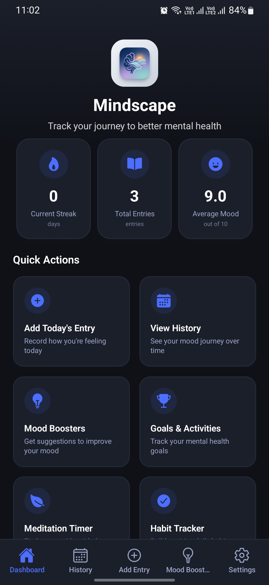
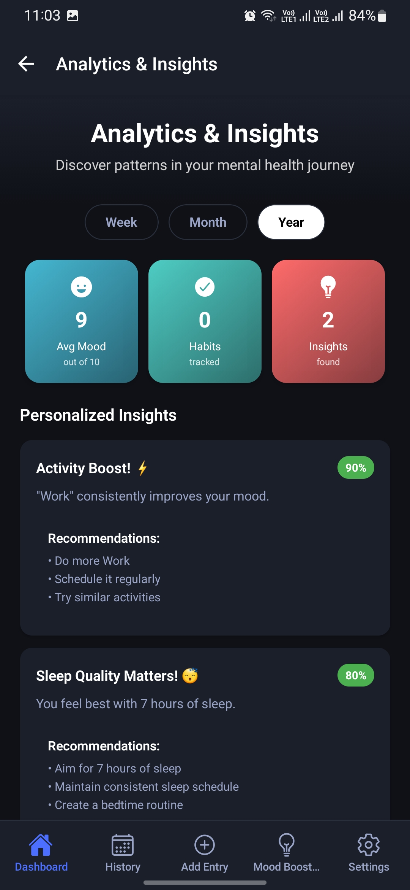
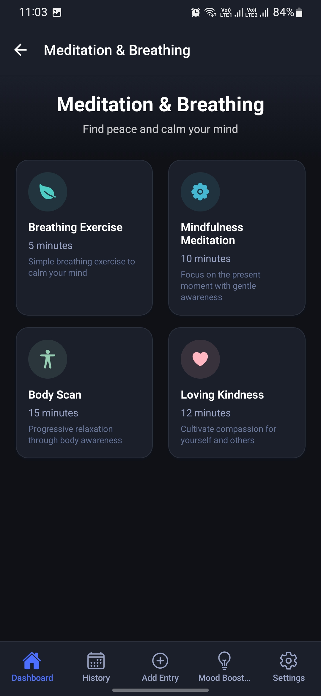
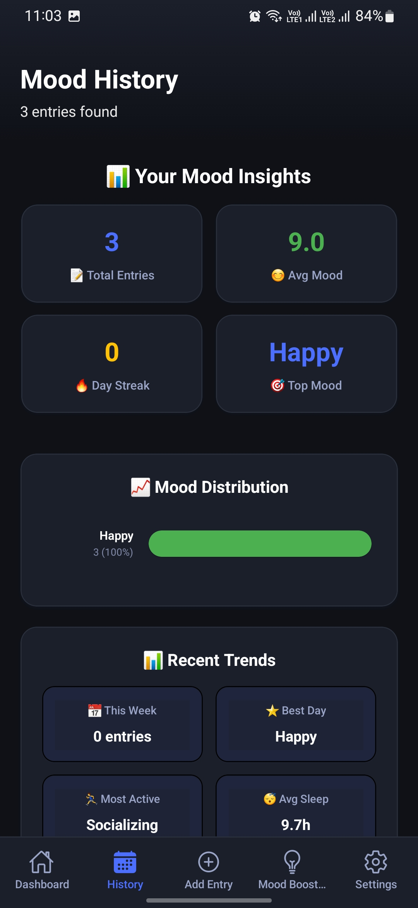
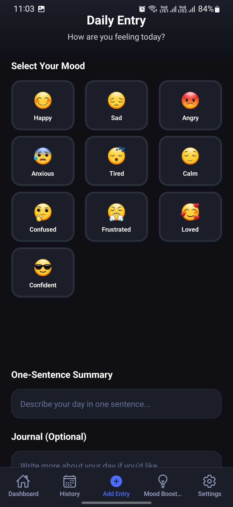
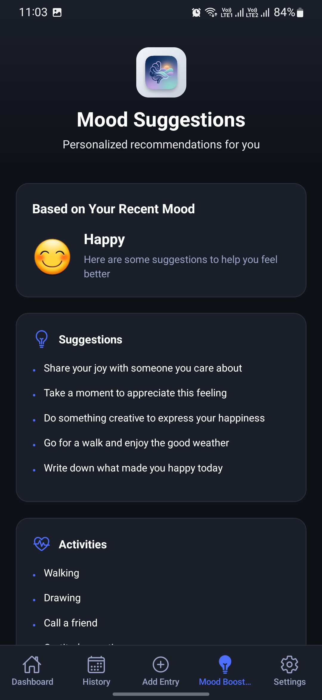
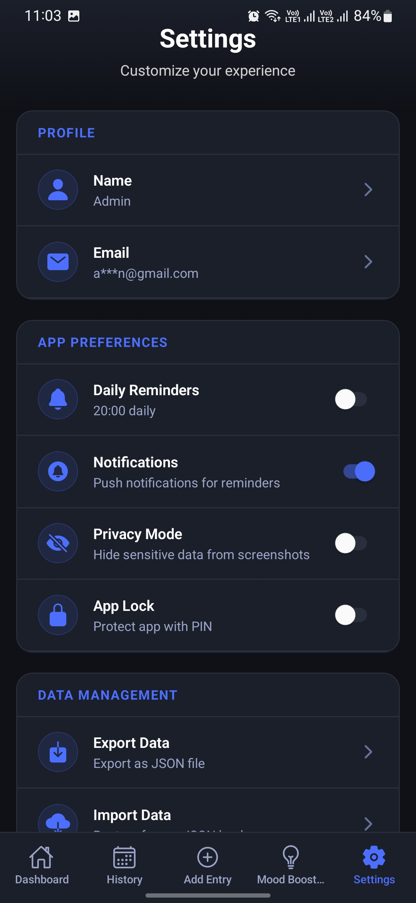

# 🧠 Mindscape — Mental Health Tracker

A comprehensive mental health tracking platform built with React Native (Expo), Django REST API, and a Node.js OAuth server. Mindscape helps users monitor mood, build healthy habits, set goals, and gain insights into their mental well-being — all in a clean, privacy-first mobile experience.

---

## Screenshots

<p align="center">
  &nbsp;
  &nbsp;
  &nbsp;
  &nbsp;
  
</p>
<p align="center">
  &nbsp;
  
</p>

---

## Project Structure

```
mental health tracker/
├── MentalHealthTracker/     ← React Native / Expo mobile app (primary frontend)
├── backend_django/          ← Django REST API (primary backend)
├── api/                     ← Vercel serverless functions (Google OAuth)
├── lib/                     ← Shared Node.js utilities (MongoDB, JWT, User model)
├── server.js                ← Express OAuth server (Vercel / standalone)
└── Screenshots/             ← App screenshots
```

---

## Tech Stack

| Layer | Technology |
|-------|-----------|
| Mobile App | React Native 0.81, Expo SDK 54, TypeScript |
| Navigation | React Navigation v7 (Stack + Bottom Tabs) |
| State / Data | TanStack React Query v5, AsyncStorage |
| Local DB | expo-sqlite (offline-first) |
| Backend | Django 4.2, Django REST Framework 3.15 |
| Auth | Google OAuth 2.0, Firebase Auth, JWT |
| OAuth Server | Node.js / Express (Vercel) |
| Database | SQLite (dev) → PostgreSQL (prod) |
| Build | EAS Build (Expo Application Services) |

---

## Features

### Authentication
- Google Sign-In (native + web OAuth flow)
- Email / password login and signup
- OTP-based password reset via email
- App lock with PIN / biometric (auto-lock on background)

### Mood & Daily Tracking
- 5-level mood system: Excellent / Good / Neutral / Bad / Terrible
- Daily mental health entries — mood, sleep hours, energy (1–10), stress (1–10), notes
- Multiple mood logs throughout the day

### Goals & Habits
- Goal types: daily, weekly, monthly, long-term with progress tracking
- Habit tracker with streak tracking (current + longest)
- Per-habit reminder times and completion toggle

### Wellness Tools
- Meditation and breathing sessions (mindfulness, guided, body scan, etc.)
- Mood before/after session tracking

### Assessments
- PHQ-9 (depression) and GAD-7 (anxiety) questionnaires
- Auto-scoring with result categories (Minimal / Mild / Moderate / Severe)
- Historical response tracking

### Insights & Analytics
- Mood trends over time
- Habit performance and completion rates
- Sleep-mood and activity-mood correlations
- Stress patterns by day of week
- AI-generated wellness suggestions and insights

### Privacy & Settings
- Dark / Light theme
- Privacy mode
- Data export
- Trusted contacts (nominees) with stress-threshold auto-alerts

---

## Quick Start

### Mobile App

```bash
cd MentalHealthTracker
npm install
npx expo start
```

Scan the QR code with Expo Go, or press `a` for Android emulator / `i` for iOS simulator.

### Django Backend

```bash
cd backend_django
pip install -r requirements.txt
cp env.example .env        # fill in your values
python manage.py migrate
python manage.py populate_initial_data
python manage.py runserver
```

The API will be available at `http://localhost:8000/api/`.

### OAuth Server (Vercel / Node.js)

Set the following environment variables (in `.env` locally or in the Vercel dashboard):

```env
GOOGLE_CLIENT_ID=your_google_client_id
GOOGLE_CLIENT_SECRET=your_google_client_secret
APP_DEEP_LINK=mentalhealthtracker://auth
PUBLIC_BASE_URL=https://your-vercel-app.vercel.app
DJANGO_API_BASE_URL=https://your-django-backend.com
```

Deploy to Vercel with `vercel --prod`, or run locally with `node server.js`.

---

## Environment Variables

### `MentalHealthTracker/.env`

```env
EXPO_PUBLIC_FIREBASE_API_KEY=...
EXPO_PUBLIC_FIREBASE_AUTH_DOMAIN=...
EXPO_PUBLIC_FIREBASE_PROJECT_ID=...
EXPO_PUBLIC_GOOGLE_CLIENT_ID=...
EXPO_PUBLIC_API_BASE_URL=http://localhost:8000
```

### `backend_django/.env`

```env
DJANGO_SECRET_KEY=...
GOOGLE_CLIENT_ID=...
GOOGLE_CLIENT_SECRET=...
GOOGLE_REDIRECT_URI=http://127.0.0.1:8000/auth/google/callback
APP_JWT_SECRET=...
EMAIL_HOST_PASSWORD=...          # Gmail App Password for OTP emails
FIREBASE_CREDENTIALS_PATH=...   # Optional: path to Firebase service account JSON
```

---

## Building for Production

### Android APK

```bash
cd MentalHealthTracker

# Preview build (for testing)
eas build --platform android --profile preview

# Production build
eas build --platform android --profile production
```

### iOS

```bash
# Development (simulator)
eas build --platform ios --profile development

# Production (App Store)
eas build --platform ios --profile production
```

---

## Documentation

| File | Contents |
|------|----------|
| [MentalHealthTracker/README.md](./MentalHealthTracker/README.md) | Mobile app setup, features, build commands, environment config |
| [backend_django/README.md](./backend_django/README.md) | Django API endpoints, data models, deployment guide |
| [CHANGELOG.md](./CHANGELOG.md) | All bug fixes, OAuth setup issues, and configuration changes made during development |

---

## Author

**Krushang Prajapati**
- Email: krushangrprajapati@gmail.com
- GitHub: [@krushang_04](https://github.com/krushang_04)

---

> Mindscape is a tool to help track your mental health — not a substitute for professional care. If you're experiencing severe distress, please reach out to a mental health professional.
